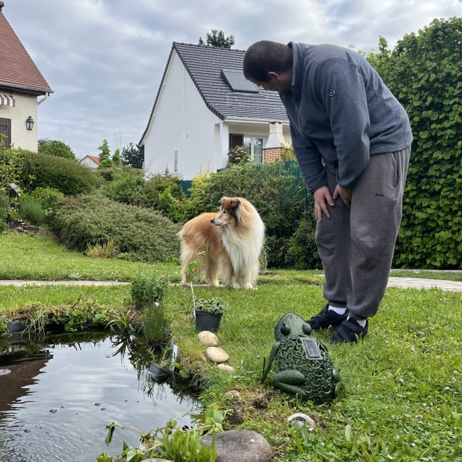
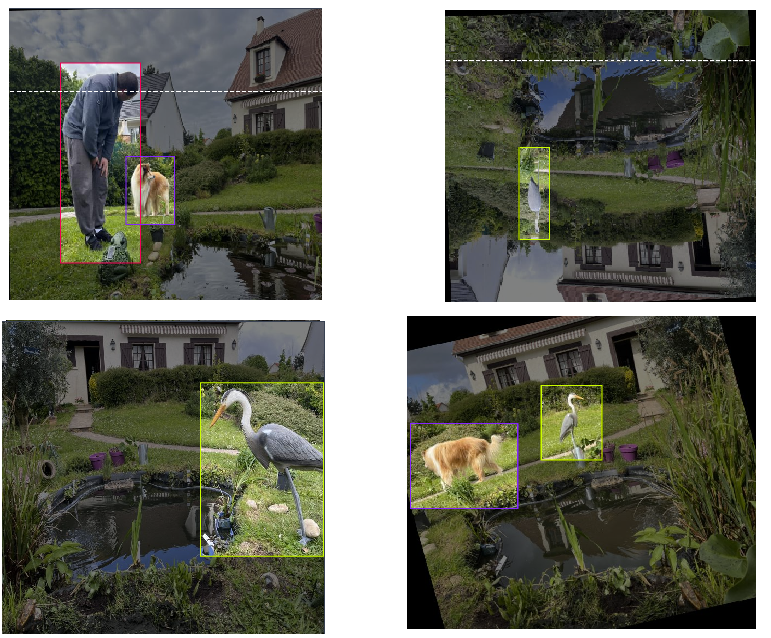
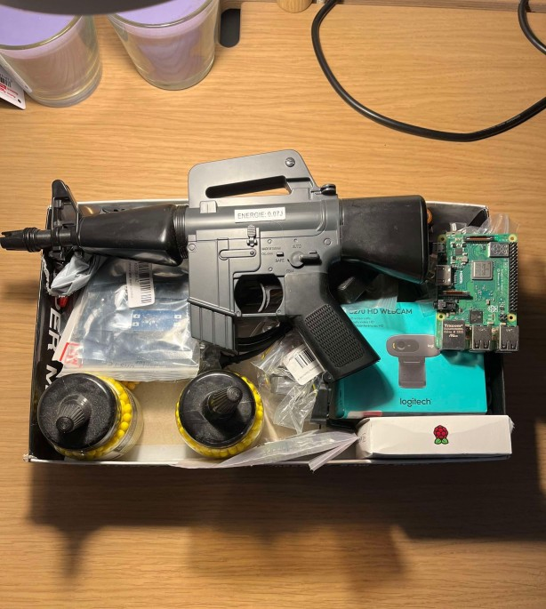

# 🐟 Heron Detector with YOLOv10 (IN PROGRESS)

Every spring, an uninvited guest visits my home – **the heron**. 

While beautiful, these birds have a bad habit of swooping into my garden and eating the fish in my pond 🐠. 

So, to protect my fish and maintain the tranquility of my garden, I've decided to create an **automatic turret** 🤖 equipped with a nerf gun (0.07J) to shoot them away!

This project leverages YOLOv10 for real-time object detection to identify herons and automatically activate a turret to spray them, keeping my fish safe 🐠💧.

## 🎯 The Challenge

The main challenge of this project is to build an accurate detection model that can correctly identify herons while avoiding misclassification with other entities like humans (my family) and my dog 🐕🚶‍♂️. 

The goal is to make sure only herons trigger the water turret, keeping innocent bystanders dry!

## 🤖 Fine-Tuning YOLOv10

To achieve this, I need to **fine-tune** YOLOv10 with images taken from my garden, using the exact environment where the turret will be installed. This fine-tuning allows the model to learn the specific characteristics of herons in the garden context, improving detection accuracy and minimizing false alarms for humans or pets.

## 🖼️DATASET CREATION

### 1. Took pictures inside my garden on the specific spot where the turret will be.

### 2. Convert `png` format to `HEIC`.

- Converting the `HEIC` format images taken by iphone to `png` using [convert_HEIC_to_png](utils/convert_HEIC_to_png.py).

### 3. Use Robotflow to create the final dataset.

- Using **RoboFlow** to **annotate** / split into **train-validate-test** / **augment** my images : available at [Robotflow_dataset](https://universe.roboflow.com/tarendrilworkshop/heron_detector-ooasg/dataset/2).

## 🏋️‍♂️ STEPS for CUSTOM TRAINING OF MODEL

The training has been done using `Google Colab` with this notebook [training_colab_notebook](https://colab.research.google.com/drive/1QLwyPCJ1VAqX1CHXClcsP32Uh7To-CbU?usp=sharing).

The results are still not satisfying.

## 🔧 Creation of the Automatic Turret

Now that the detection model is in place, it's time to build the automatic turret 🤖🔫 that will take action against the intruding herons. With all the necessary components on hand, the turret will be able to detect, target, and shoot inoffensive plastic bullets (0.07J) to deter herons from invading my garden pond.

### 🛒 Components Checklist 📝

- **Electric Airsoft** 🔫
    - The main firing mechanism for shooting inoffensive plastic bullets at herons.

- **Raspberry Pi 3 Model B** 💻
    - Acts as the brain for processing images from the camera and controlling the turret movement.

- **Logitech C210 Webcam** 📸
    - Captures the video feed for YOLOv10 to detect herons in real-time.

- **Adafruit TB6612 Motion Motor Control Shield Board** ⚙️
    - Controls the movement of the turret, managing the stepper motors.

- **NEMA 17 Stepper Motor, 200 Steps/Rev** 🔄
    - × 2: Provides smooth and precise movement to pan and tilt the turret.

- **Single Relay** 🔌
    - Acts as a switch to control the firing mechanism of the gun.

- **Step Up Converter** ⚡
    - Ensures consistent power supply to components by converting voltage as needed.

- **Portable Cell Phone Charger** 🔋
    - Power supply for the Raspberry Pi and other electronic components, making the turret mobile.

- **Female/Female Jumper Wires** 🔌
    - Allows for easy connections between the Raspberry Pi, motors, and other components.

- **USB-A to Micro-USB Cable** 🔌
    - Provides power from the charger to the Raspberry Pi.

## 🛠️ Tech Stack

- **Python** 🐍: Programming language
- **YOLOv8-v10** 🤖: Real-time object detection aiming to accurately predict object categories and positions in images with low latency.
- **Robotflow** 🖥️: Platform that helps you create, train, and deploy computer vision models with ease.
- **Electronical components** : Necessary electronical components (camera, rasberry pie...).

## 👥Authors

**Thomas Bordes** 🧑‍💻

## 📚 Acknowledgements
 
- **🎥 Youtube video to train custom YOLO model** : [Train a Custom Model](https://www.youtube.com/watch?v=29tnSxhB3CY&ab_channel=NicolaiNielsen)

- **🛠️ Automatic turret project with Nerf gun** : [Create automatic turret](https://www.hackster.io/hackershack/raspberry-pi-motion-tracking-gun-turret-77fb0b)

- **💻 Git of the automatic turret project with Nerf gun** : [Git automatic turret](https://github.com/HackerShackOfficial/Tracking-Turret)

- **📸 Youtube video to connect YOLO model to webcam** : [Connect webcam to YOLO model](https://www.youtube.com/watch?v=QV85eYOb7gk&ab_channel=Roboflow)